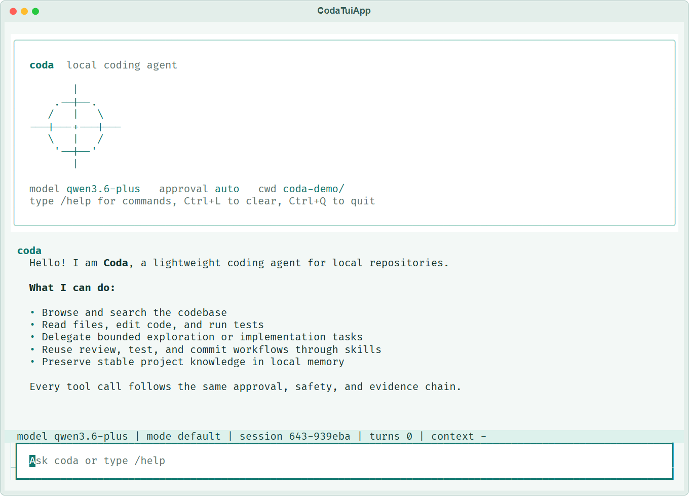
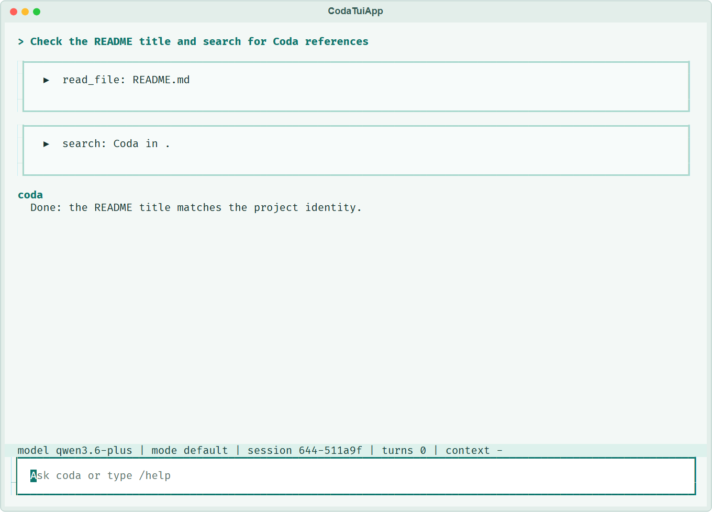
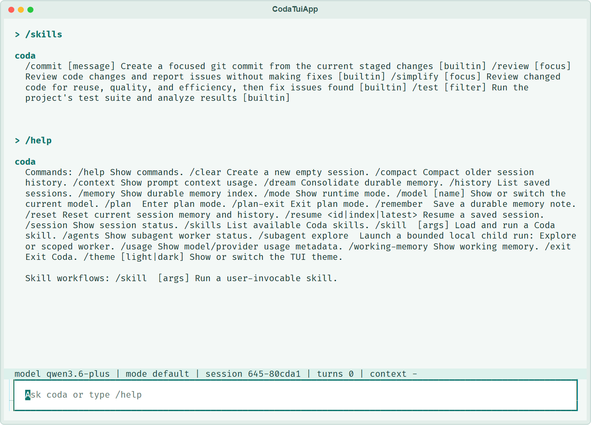
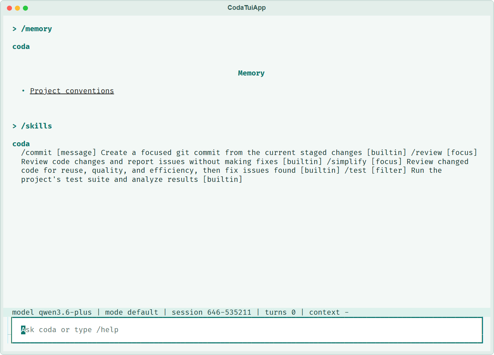
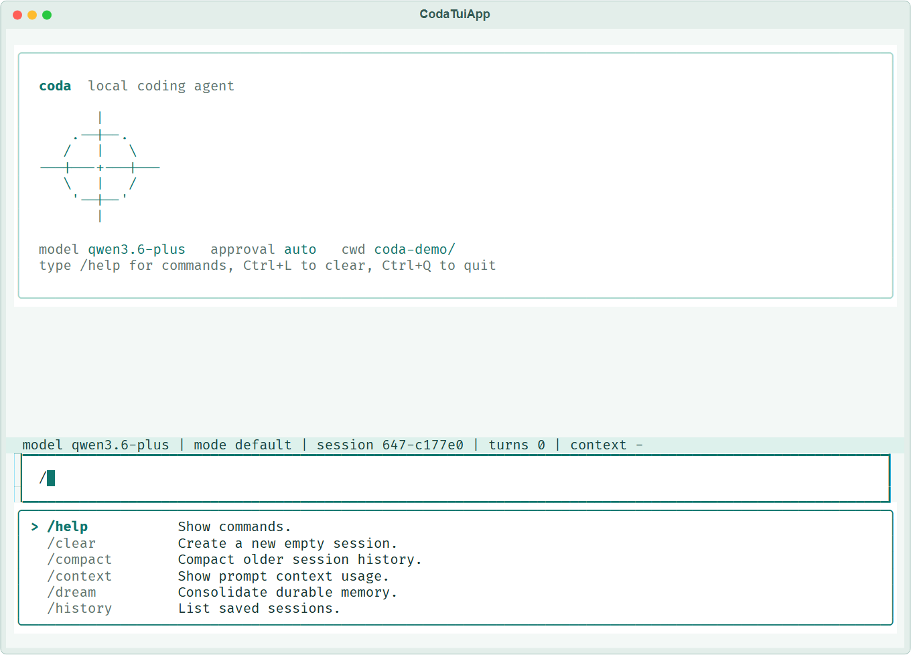

<div align="center">

<h1>
  
  Coda
</h1>

**轻量、本地、有记忆的终端 coding agent**

Coda 运行在你的本地仓库中。连接一个模型 provider 后，它可以读代码、执行命令、修改文件、保留运行证据，并把值得复用的上下文沉淀为项目记忆。

</div>

<p align="center">
  
</p>

---

## Coda 是什么

Coda 提供 Textual TUI、普通终端 REPL 和 one-shot 三种使用方式，适合从快速问答到持续推进一个编码任务：

- **理解代码**：读取和搜索仓库、运行命令与测试，快速熟悉陌生项目。
- **修改与验证**：编辑文件、应用补丁，并根据检查和测试结果继续修正。
- **规划与审查**：先梳理复杂任务的执行方案，或检查当前改动的质量与风险。
- **续接任务**：保存会话和任务进度，稍后从上次中断的位置继续。
- **Skills 与子 Agent**：复用 review、test、commit 等工作流，也可以并行探索代码或处理限定范围的修改。
- **项目记忆**：记录约定、决策和排查结论，在后续会话中继续使用。

Coda 关注的不只是“能改代码”，也包括配置是否清楚、修改是否受控、任务能否续接，以及结果能否复盘。

## 界面

默认入口是 Textual TUI，可集中查看对话、工具执行结果和任务状态，并使用 slash command 与命令补全。界面默认使用浅色青绿主题；运行期间可通过 `/theme light` 或 `/theme dark` 在浅色与原深色主题之间切换。

| 工具和子 agent | Skills、help 和命令补全 |
| --- | --- |
|  |  |

| Memory 和 durable topics | Slash command 工作区 |
| --- | --- |
|  |  |

## 测评

Coda 已完成公开入口真人场景、固定编码任务和确定性模块评测：

| 评测 | 样本范围 | 结果 |
| --- | --- | --- |
| v3 真人场景 | 50 个 CLI、REPL、TUI 及功能组合场景 | 50/50 通过；同期 pytest 为 224 passed、2 skipped |
| Evaluation v2 正式编码基线 | 3 个本地仓库、9 个任务、每个任务 3 次，共 27 条运行 | 27/27 有效，26/27 通过隐藏验证，verified-run success 96.30%，invalid=0 |
| Evaluation v2 模块基线 | Harness、Context、Working memory、Recovery | Harness 12/12；Context 平均字符压缩率 10.66%、当前请求保留率 100%；`memory_on` 重复读取为 0、正确率 100%；恢复成功率 90%、workspace drift 检出率 100%、false accept 0% |

Evaluation v2 同期全仓回归为 654 passed、2 skipped。

> 结果对应各自记录的代码快照、模型和样本范围；方法、逐项结果、证据边界与改进建议见 [综合测评报告](docs/evaluation.md)。

## 安装

主要支持 Linux 和 macOS。开始前需要 Git、Python 3.10+，以及至少一个可用的模型 provider key。

### 一键安装脚本

```bash
curl -fsSL https://raw.githubusercontent.com/Papewhit/coda/main/install.sh | bash
```

安装器会创建独立虚拟环境、安装运行所需依赖，并把 `coda` 启动器放到 `~/.local/bin/`。

### 从源码安装

先取得源码：

```bash
git clone https://github.com/Papewhit/coda.git
cd coda
```

使用 pip：

```bash
python -m pip install -e ".[providers]"
coda
```

或使用 uv：

```bash
uv sync --extra providers
uv run coda
```

Windows 可以使用源码安装流程运行 Coda；一键安装脚本面向类 Unix shell。完整的 `bubblewrap` shell sandbox 仅支持 Linux。

## 配置 provider

**Provider profile** 是一组可复用的模型连接设置，包括凭据、endpoint、模型和请求格式。

配置合并优先级是：

```text
CLI 参数 > 环境变量 > 项目 .coda.toml > 全局 ~/.config/coda/config.toml > 代码默认值
```

### 项目 `.coda.toml`（推荐）

为每个仓库建立独立 profile：

```toml
provider = "example"

[providers.example]
wire_dialect = "openai-responses"
api_key = "replace-with-your-key"
base_url = "https://provider.example/v1"
model = "model-name"

[providers.example.capabilities]
native_tools = true
```

把 `api_key`、`base_url`、`model` 和 `wire_dialect` 改为所用服务的值。兼容 OpenAI Responses API 的 endpoint 使用 `openai-responses`；兼容 Anthropic Messages API 的 endpoint 使用 `anthropic-messages`。Coda 的编码任务需要 `native_tools = true`。

### 环境变量覆盖

环境变量适合注入密钥或临时覆盖已有 profile：

```bash
export CODA_API_KEY=sk-...
export CODA_BASE_URL=https://provider.example/v1
export CODA_MODEL=model-name
coda
```

可用的通用变量包括 `CODA_PROVIDER`、`CODA_API_KEY`、`CODA_BASE_URL`、`CODA_MODEL` 和 `CODA_WIRE_DIALECT`。

### 命令行临时覆盖

临时换 provider 或模型：

```bash
coda --provider openai --model gpt-5.4 --base-url https://api.openai.com/v1
coda --provider deepseek --approval ask --max-steps 80
coda --config /path/to/custom.toml --cwd /path/to/repo
```

> 完整的字段、能力声明和配置方式见 [配置文档](docs/configuration.md)。

## 启动

Coda 默认进入 Textual TUI，也可以使用普通终端 REPL、直接执行 one-shot 任务，或续接已有会话：

```bash
coda                                # Textual TUI
coda --repl                         # 普通终端 REPL
coda "找出测试失败的根因"            # one-shot 任务
coda --resume latest                # 续接最近 session
coda --cwd /path/to/repo            # 指定工作目录
```

常用控制参数：

```bash
coda --approval ask                 # 高风险工具在交互环境中请求确认（默认）
coda --approval auto                # 自动通过普通操作
coda --approval never               # 拒绝高风险工具，仍允许只读工具
coda --sandbox best_effort          # 尝试隔离 run_shell，不可用时退化为直跑
coda --sandbox required             # sandbox 不可用时拒绝 run_shell
coda --no-auto-dream                # 关闭后台 memory 整合
```

## 日常用法

进入 TUI 或 REPL 后可以直接输入自然语言，也可以用 slash command：

```text
> /help
> 找出测试失败的根因
> /plan 为 API 客户端增加重试并补充测试
> /subagent explore 梳理支付模块的调用流程
> /review
> /test tests/test_config.py
> /remember 新增接口时需要同时更新集成测试
> /dream
```

### 内置命令

| 命令 | 作用 |
| --- | --- |
| `/help` | 查看内置命令。 |
| `/clear` | 创建一个新的空 session。 |
| `/compact` | 缩短较早的对话，同时保留当前任务重点。 |
| `/context` | 查看当前上下文的使用情况。 |
| `/dream` | 整理近期项目记忆，提炼可长期复用的内容。 |
| `/history` | 列出可以续接的历史会话。 |
| `/memory` | 查看已保存的项目记忆。 |
| `/mode` | 查看当前工作模式和正在进行的计划。 |
| `/model [name]` | 查看或临时切换当前模型。 |
| `/plan <topic>` | 为指定任务进入规划模式。 |
| `/plan-exit` | 退出规划模式。 |
| `/remember <text>` | 保存一条可供后续会话使用的项目记忆。 |
| `/reset` | 重置当前会话的记忆与历史。 |
| `/resume <id\|index\|latest>` | 续接指定或最近的会话。 |
| `/session` | 查看当前会话及相关本地记录。 |
| `/skills` | 列出当前可调用的 Skills。 |
| `/agents`（`/agent`） | 查看子 agent 状态。 |
| `/subagent explore <task>`（`/sub`） | 启动只读 Explore 子 agent。 |
| `/subagent worker --scope <path[,path]> <task>` | 启动限定写入范围的 Worker。 |
| `/theme [light\|dark]` | 查看或切换当前 TUI 主题；设置仅在本次运行期间有效。 |
| `/usage` | 查看当前 provider、model 和 token 用量。 |
| `/working-memory` | 查看当前任务的工作记忆。 |
| `/exit`（`/quit`） | 退出 Coda。 |

> 记忆的记录、整理和复用方式见 [记忆文档](docs/memory.md)。

### 内置 Skills

| Skill | 作用 |
| --- | --- |
| `/simplify [focus]` | 检查已改代码的复用、质量和效率，并直接修正问题。 |
| `/review [focus]` | 审查当前改动并报告问题，不执行修复。 |
| `/commit [message]` | 从当前改动创建聚焦的 Git commit。 |
| `/test [filter]` | 运行相关测试并分析结果。 |

用户和项目 Skills 也可以直接以 `/<name>` 调用；用 `/skills` 查看当前 session 实际发现的完整清单。

> 内置和自定义 Skills 的使用与编写方式见 [Skills 文档](docs/skills.md)。

## 隐私与权限

Coda 的配置、会话、运行记录和记忆保存在本地。向 provider 请求模型响应时，当前任务及完成任务所需的上下文会发送给该 provider，其中可能包含代码片段、对话历史和相关记忆。

- **操作确认**：`ask` 会在执行写文件、shell 等高风险操作前请求确认；`auto` 无需逐次确认；`never` 拒绝高风险操作，但仍可读取和分析代码。
- **文件范围**：文件操作限制在当前 workspace 内；启动 Worker 时，`--scope` 指定它可以修改的目录。
- **Shell 隔离**：sandbox 只作用于 `run_shell`。默认 `off`；`best_effort` 在隔离不可用时继续直接执行；`required` 则拒绝未隔离的 shell。完整的 `bubblewrap` sandbox 仅支持 Linux。
- **凭据保护**：shell 仅接收有限的环境变量；已识别的密钥以及通过 `--secret-env-name` 指定的变量会在本地运行记录中脱敏。使用时仍应避免把凭据写入源码、对话或长期记忆。

> 详细边界与配置见 [Sandbox 文档](docs/sandbox.md)。

## 本地文件

### 常用文件

| 数据 | 路径 |
| --- | --- |
| 项目配置 | `.coda.toml` |
| 全局配置 | `~/.config/coda/config.toml` |
| 会话历史 | `.coda/sessions/<id>.json` |
| 记忆索引 | `.coda/memory/MEMORY.md` |
| 每日记忆 | `.coda/memory/logs/YYYY/MM/YYYY-MM-DD.md` |
| 长期主题记忆 | `.coda/memory/topics/*.md` |
| 用户 Skills | `~/.coda/skills/<name>/SKILL.md` |
| 项目 Skills | `skills/<name>/SKILL.md` 或 `.coda/skills/<name>/SKILL.md` |
| 计划文件 | `.coda/plans/<topic>-plan.md` |

### 追踪与审计

| 数据 | 路径 |
| --- | --- |
| 事件流 | `.coda/sessions/<id>.events.jsonl` |
| 运行证据 | `.coda/runs/<run_id>/` |

## 开发和维护

以下内容面向参与项目开发和维护的读者。

### 项目结构

```text
coda/
├── cli.py                 # CLI 参数、启动模式、REPL 命令
├── tui/                   # Textual TUI
├── commands/              # slash commands
├── config/                # provider profile、TOML、env 解析
├── core/                  # runtime、engine、session、workers、context
├── features/              # memory、skills、sandbox
├── providers/             # OpenAI-compatible / Anthropic-compatible client
├── tools/                 # tool registry 和具体工具
└── evaluation/            # run evidence、metrics、evaluation helpers
```

### 测试

```bash
uv sync --extra providers
uv run ruff check .
uv run pytest tests -q

# 真人场景检查
uv run python scripts/run_v3_human_scenario_gate.py

# 连接真实 provider 的烟测，需要先配置 key
CODA_LIVE_SMOKE=1 uv run pytest tests/test_release_smoke.py -q
```

发布前需要运行完整真人场景套件：`uv run python scripts/run_v3_human_scenario_gate.py --suite full`。

### 架构资料

维护 provider 或工具执行链时，请参阅 [原生工具调用协议](docs/architecture/native-tool-contract.md)。

## 参考文档

| 入口 | 内容 |
| --- | --- |
| [配置](docs/configuration.md) | provider profiles、wire dialect、能力声明、环境变量和 CLI 覆盖。 |
| [分层记忆 + auto-dream](docs/memory.md) | working memory、daily logs、durable topics 和后台整合。 |
| [Skills](docs/skills.md) | `SKILL.md` 目录结构、内置技能和自定义 workflow。 |
| [Sandbox](docs/sandbox.md) | `run_shell` 隔离模式、backend 选择和文件系统边界。 |
| [综合测评](docs/evaluation.md) | v3 真人场景、Evaluation v2 编码基线、模块指标及综合结论。 |
| [原生工具调用协议](docs/architecture/native-tool-contract.md) | provider-native tool call/result 的核心边界与安全链。 |
